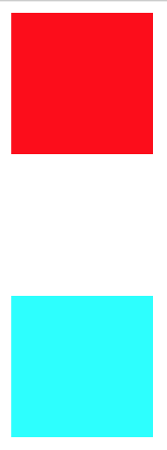
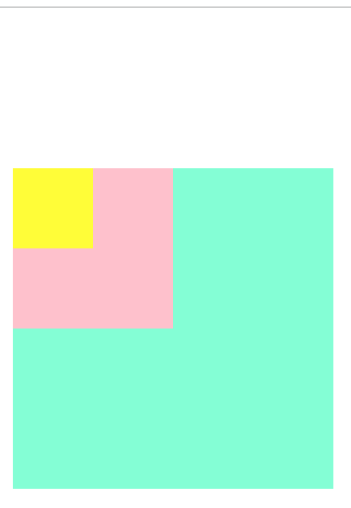
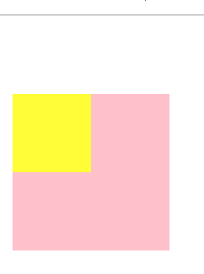

[toc]

### 什么是margin塌陷

- 在垂直方向如果两个元素的外边距有相遇，那么浏览器加载的真正的外边距不是两个边距的和，而是距离比较大的那个值。
- 边距小的塌陷到了边距大的内部

1. 同级元素塌陷：上面的元素有下边距，下面的元素有上边距，真正盒子之间是距离较大的值
```html
<div>
    <div class="box1"></div>
    <div class="box2"></div>
</div>
```
```css
 .box1{
    width: 100px;
    height: 100px;
    background-color: red;
    margin-bottom: 100px;
}
.box2{
    width: 100px;
    height: 100px;
    background-color: cyan;
    margin-top: 50px;
}
```

2. 父子元素塌陷：
(1) 父元素和子元素都设置了同一方向的margin值，子元素处于这个方向的最顶部，没有东西隔离父元素边界和子元素顶部，就会发生margin塌陷，margin小的值，陷入了margin大的里面
```html
<div class="back">
    <div class="container">
        <div class="box"></div>
    </div>
</div>
```
```css
.back{
    background-color: aquamarine;
    width: 200px;
    height: 200px;
}
.container{
    width: 100px;
    height: 100px;
    background-color: pink;
    margin-top: 100px;
}
.box{
    width: 50px;
    height: 50px;
    background-color: yellow;
    margin-top: 50px;
}
```

(2) 本身父元素与上一个元素距离为0，而子元素对上有边距，如果没有东西隔离，那么，父元素和子元素会一起顶下来
```html
<div class="container">
    <div class="box"></div>
</div>
```
```css
.container {
    width: 100px;
    height: 100px;
    background-color: pink;
}

.box {
    width: 50px;
    height: 50px;
    background-color: yellow;
    margin-top: 50px;
}
```


3. 优化方案
> 1. 同级元素, 可以直接只设置一个margin值
> 2. 父子元素，可以用padding设置父子距离，而不是margin