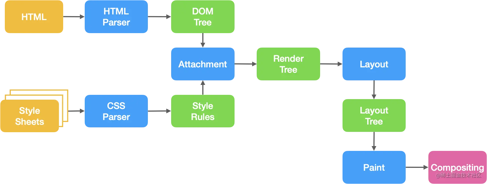

[参考：https://juejin.cn/post/7064077572132323365#comment](https://juejin.cn/post/7064077572132323365#comment)
[toc]

# reFlow & rePaint
回流(重排)和重绘

## 构建render tree 的过程

- 解析html构建dom 树
- 解析css构建cssom 树
- 从dom树的根节点遍历每个可见节点 （注释、标记、display为none不在dom树）
- 对于每个可见节点，为其匹配合适的cssom规则并应用它们
- 发射可见节点，连同内容和可见样式

有了渲染树，我们就可以进行布局计算

- 布局计算每个dom对象的精确位置和大小
- 渲染（绘制，合成），使用最终渲染树将像素渲染到屏幕上

## 回流（重排）

- 当dom树的某一部分元素因为尺寸，布局，大小，隐藏等改变而导致的页面重新构建布局。
- 每个页面至少会发生一次回流。在构建render tree渲染时发生的
- 回流就是计算元素在设备内的确切位置和大小并且重新绘制
- 回流的代价要远大于重绘。并且回流必然会造成重绘，但重绘不一定会造成回流。

## 重绘 
- 改变只是元素的外表，而不是几何属性，在页面中的位置，以及尺寸和大小。这时候就会发生重绘
- 重绘就是改变像素颜色，不涉及大小和位置

### 回流一定发生重绘，重绘不一定会回流

### 不建议频繁操作dom

其一，因为dom布局绘制运行在渲染引擎
而js运行在JS引擎
所以js的dom操作一定会出发这两个线程之间的通信
一直操作dom触发通信过多一定会造成性能上的损耗

其二，频繁操作dom一定会引起重绘和重排，大大影响性能，不见以过多操作

## 触发回流

1. 页面首次渲染（无法避免且开销最大的一次）
2. 浏览器窗口大小发生改变（resize事件）
3. 元素尺寸或位置发生改变（边距、宽高、边框等）
4. 元素内容变化（文字数量或图片大小等等）
5. 元素字体大小变化（font-size）
6. 添加或者删除可见的DOM元素
7. 激活CSS伪类（例如：:hover）
8. 查询某些属性或调用某些方法

## 触发重绘
color
background-image

## 浏览器优化机制

由于每次重排都会造成额外的计算消耗，因此大多数浏览器都会通过队列化修改并批量执行来优化重排过程。浏览器会将修改操作放入到队列里，直到过了一段时间或者操作达到了一个阈值，才会进行批量修改并清空队列。但是，在获取布局信息的时候，会强制刷新队列