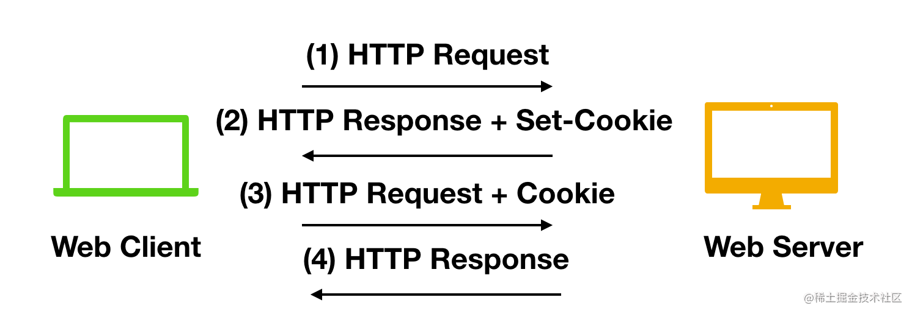

## session

客户端请求服务端，服务端会为这次请求开辟一块内存空间，这个对象就是Session对象。
Session 为了弥补HTTP的无状态性，服务器可以利用Session存储客户端在同一个会话期间的一些操作

## session如何判断同一会话

1. 接到请求后在服务器开辟一些空间来存放session对象，同时生成一个session-id
2. 并通过响应头的 **Set-Cookie：JSESSIONID=XXXXXXX **命令，向客户端发送要求设置 Cookie 的响应
3. 客户端收到响应后，在本机客户端设置了一个 **JSESSIONID=XXXXXXX **的 Cookie 信息，该 Cookie 的过期时间为浏览器会话结束；

至此之后

1. 接下来客户端每次向同一个网站发送请求时，请求头都会带上该 Cookie信息（包含 sessionId ）， 然后，服务器通过读取请求头中的 Cookie 信息，获取名称为 JSESSIONID 的值，得到此次请求的 sessionId。

## session的缺点

1. 不利于分布式服务的认证，因为不同的服务器上可能不存在建立的session对象
2. 而且比较耗费内存

