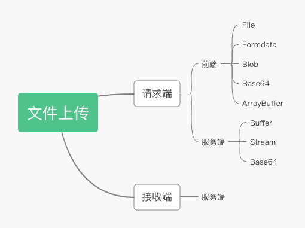

[toc]

# 上传文件

## 如何拿到文件
### 选中文件
- 选中单个文件
```html
<input type="file" name="" id="file" multiple = {false}>
```
- 选中多个文件
```html
<input type="file" name="" id="file" multiple = {true}>
```
### 选中之后读取输入拿到文件对象
```js
document.getElementById('file').onchange = function(){
    const { files } = this;
    if(files.length === 0) return;
    const file = files[0];
    console.log(file);
}
```
这时拿到的是一个文件对象列表，这个列表是一个类数组
读取其的值即可拿到文件对象

## 请求端拿到之后以什么形式上传



```js
document.getElementById('file').onchange = async function(){
    const { files } = this;
    if(files.length === 0) return;
    const file = files[0];
    // 开始上传    
    const form = new FormData;
    form.append('file', file);
    form.append('filename', file.name);
    // 发送文件
    try{
        const res = await axios.post('xxx/upload',form);
    }catch(e){
        console.log(e);
    }
}
```
转化base64
```js
const fileReader = new FileReader();
fileReader.readAsDataURL(file);
fileReader.onload = ev => {
    const base64 = ev.target.result;
}
```


## 管理进度条

```js 
const xhr =  new XMLHttpRequest();
xhr.onprogress = function(ev){
    console.log(ev.total, ev.loaded);
}
```

```js
默认fetch是无法监听流的
```